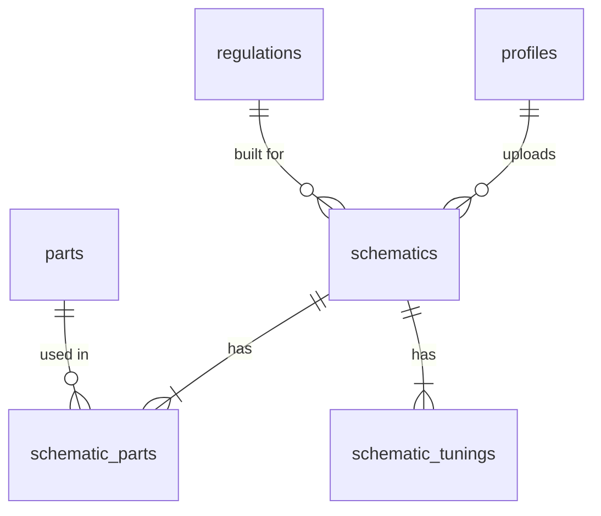

# AC4DB

A community database of **Armored Core: For Answer** schematics (AC builds). Players upload a build exported from their save file; anyone can browse it, search by parts, and download it back into their own game.

**Live:** [ac4db.org](https://ac4db.org)

## Features

- **Upload** an exported `.ac4a` schematic plus an optional screenshot. The file is parsed on the server; name, designer, parts and tuning are extracted automatically.
- **Search and filter** by name, designer or part name, leg type, regulation version, usage (PvP / PvE / Meme), and "must include" parts.
- **Schematic pages** show the full part list and tuning, with Open Graph tags for link previews.
- **Download** the original `.ac4a` file, or copy the schematic ID for direct import in the desktop tool.
- **Accounts** via Discord OAuth or email/password, with public profile pages listing each user's uploads.

## How it fits together

Schematics live inside the game's PS3 save data (`DESDOC.DAT`), which the website can't read directly. The companion desktop app, [ACFA Schematic Tool](https://github.com/tmbkoren/ACFA_Schematic_Tool) (Python/PySide6), extracts a single schematic into a standalone `.ac4a` file and can import one back, either from a file or from AC4DB by ID. Import by ID calls `GET /api/schematics/{id}/download`, so that route is a public API for the tool.

```
PS3 save data ──► ACFA Schematic Tool ──► .ac4a ──► AC4DB upload
                          ▲                                  │
                          └──────── download / import by ID ◄┘
```

### The `.ac4a` format

A single 24,280-byte schematic block. The desktop tool's Python code is the reference implementation of the format; `src/utils/lib/parseAc4a.ts` is a TypeScript port of its read side. Fields the site reads:

| Offset | Size | Field |
|---|---|---|
| `0x01` | 96 bytes | Design name, UTF-16LE, null-terminated |
| `0x61` | 96 bytes | Designer name, UTF-16LE, null-terminated |
| `0xC0` | u64 BE | Timestamp |
| `0xC8` | 1 byte | Category |
| `0xD8` | 15 × u16 BE | Part IDs, one per slot (head, core, arms, legs, FCS, generator, boosters, arm/back/shoulder units) |
| `0x126` | 28 × u8 | Tuning values |

The same part ID means different parts in different categories (66 of the 125 IDs repeat), so parts are resolved by `(game_id, lookup_category)`. Left and right arm units share the `Arm Unit` category, and likewise for back units.

## Tech stack

| | |
|---|---|
| Framework | Next.js 15 (App Router, Server Components, Server Actions) |
| UI | Mantine 8 |
| Backend | Supabase: Postgres, Auth (Discord + email), Storage |
| Hosting | Vercel |

Server Components render the listing and schematic pages, which keeps them indexable and fast on first load. Writes go through Server Actions, except the OAuth callback route, which updates the user's Discord details. Supabase covers auth, file storage and Postgres in one service, which suited a solo project. Row Level Security is the authorization layer, since the anon key is public.

## Data model



- **`parts`**: master list of every ACFA part, keyed by in-game ID and category, with a manually curated `subcategory` (e.g. leg type) for filtering.
- **`schematic_parts`**: join table, one row per slot. Normalized so the "must include parts" filter can be expressed in SQL.
- **`schematic_tunings`**: one row per tuning stat.
- **`regulations`**: game balance patch versions, grouped by family (`1.99-08k` → `1.99`).

Two Postgres functions do the heavy lifting:
- `create_schematic_with_details`: inserts a schematic with its parts and tunings in one transaction.
- `search_schematics`: all filters, sorting and pagination in one query, returning the total count through `COUNT(*) OVER()`.

## Security model

The anon key ships to every browser, so anyone can call the Supabase API directly. **Row Level Security is the authorization layer**, not the server code:

- Everything is publicly readable.
- A `schematics` row can only be inserted, updated or deleted by its owner. The app currently exposes only uploading; editing and deleting are on the roadmap.
- Part and tuning rows can only be inserted, and only for a schematic the caller owns. No one can update or delete them directly; they're removed by cascade when their schematic is deleted.
- `create_schematic_with_details` runs as the caller (`SECURITY INVOKER`), so these policies apply inside it too. It rejects a user id that isn't the caller's, and pins `search_path` to empty.
- Storage allows authenticated uploads into the two app buckets only. Files can't be overwritten or deleted by users. The buckets enforce size limits (24,280 bytes / 2 MB) and allowed file types. SVG is excluded because the buckets are public.

## Running locally

Requirements: Node 20+ and a Supabase project.

```bash
npm install
```

Create `.env.local`:

```bash
NEXT_PUBLIC_SUPABASE_URL=...
NEXT_PUBLIC_SUPABASE_ANON_KEY=...
SUPABASE_SERVICE_ROLE_KEY=...   # optional, server-only; only needed for account deletion
```

```bash
npm run dev           # dev server
npx tsc --noEmit      # type check
npm run lint          # lint
```

There's no automated test suite yet. `CLAUDE.md` holds project context and working rules for AI-assisted development.

If you point the app at a different Supabase project, update the image hostname in `next.config.ts`.

Regenerate database types after schema changes:

```bash
npx supabase gen types typescript --project-id <project-id> --schema public > database.types.ts
```

### Scripts

- `scripts/populate_parts.mjs`: seeds or upserts the `parts` table from `src/utils/lib/part_mapping.json`.
- `scripts/migrate_schematics.mjs`: one-off migration from the original JSON columns to the normalized tables.
- `scripts/check_duplicates.mjs`: checks the part mapping for duplicate names.

## Known limitations

- The files in `supabase/migrations` are incremental changes; they don't create the base `schematics` and `profiles` tables. A full baseline migration is still to do.
- Storage uploads happen before the database transaction, so a failed insert can leave an orphaned file.
- Part names exist in two places: `part_mapping.json`, used by the parser and the filter UI, and the `parts` table. The table should be the single source.
- Part IDs missing from `parts` are skipped on upload instead of being rejected.
- Tunings are always read as a whole and never queried, so a `jsonb` column would be simpler than a row per value.
- Search uses `ILIKE` and `OFFSET` pagination. That's fine at the current size; at scale it would need a `pg_trgm` index and keyset pagination.
- Deleting an account that has uploads currently fails: `schematics.user_id` has no `ON DELETE` action.

## Roadmap

- Edit and delete your own schematics (requested by users).
- Account deletion without the service-role key: a `SECURITY DEFINER` function that can only delete the caller's own account.
- A baseline migration generated from the live schema, plus a seed file for `parts` and `regulations`.
- Parser tests using real `.ac4a` files.

## Credits

- [Natsu (WarpZephyr)](https://github.com/WarpZephyr/) for reverse-engineering the save data structure and offsets.
- Suggestions and bug reports: `@tmbkoren` in the 4th gen channel of the [Armored Core Discord](https://discord.gg/armoredcore).
